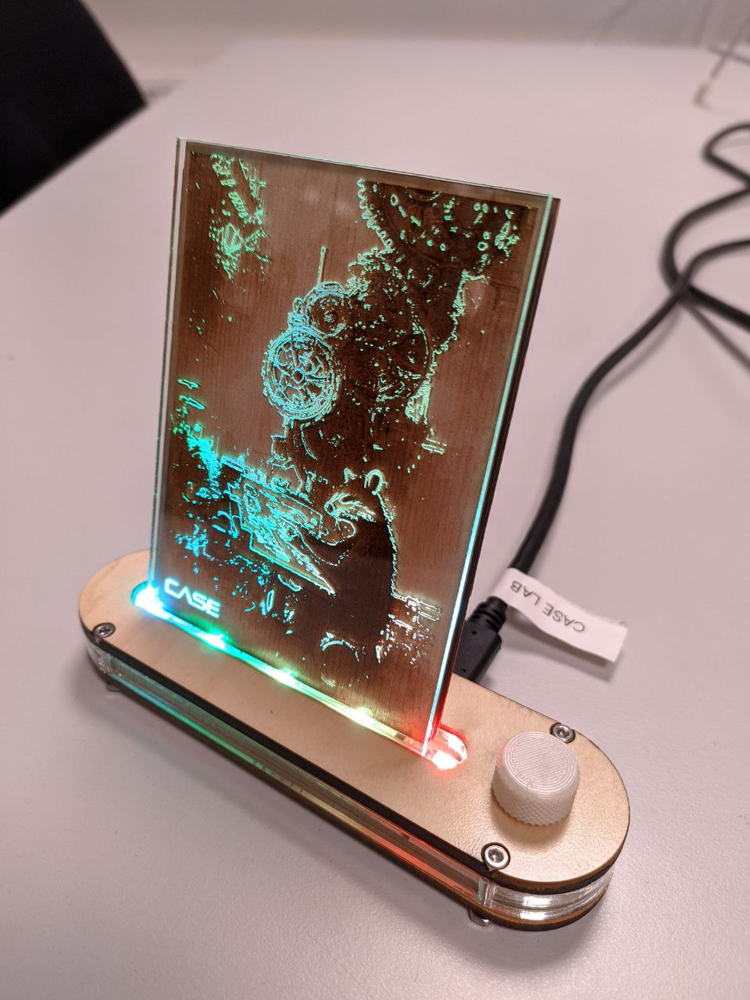
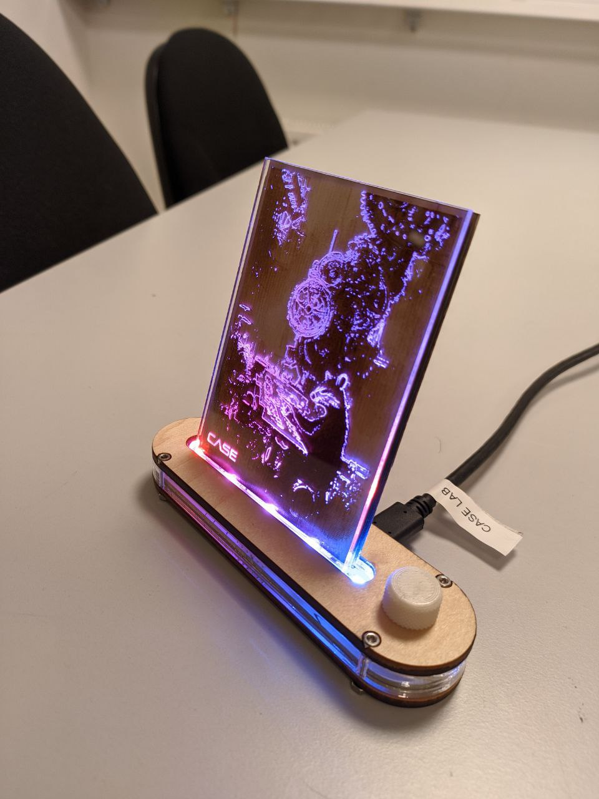
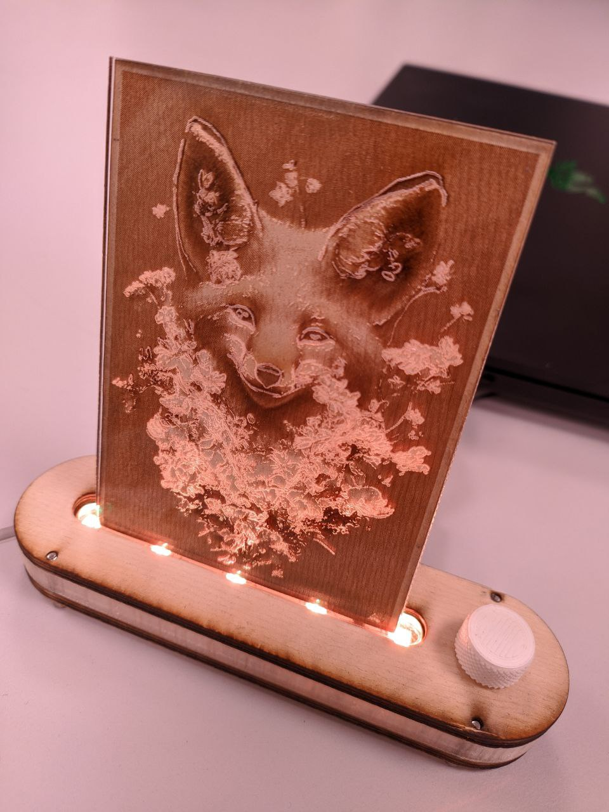
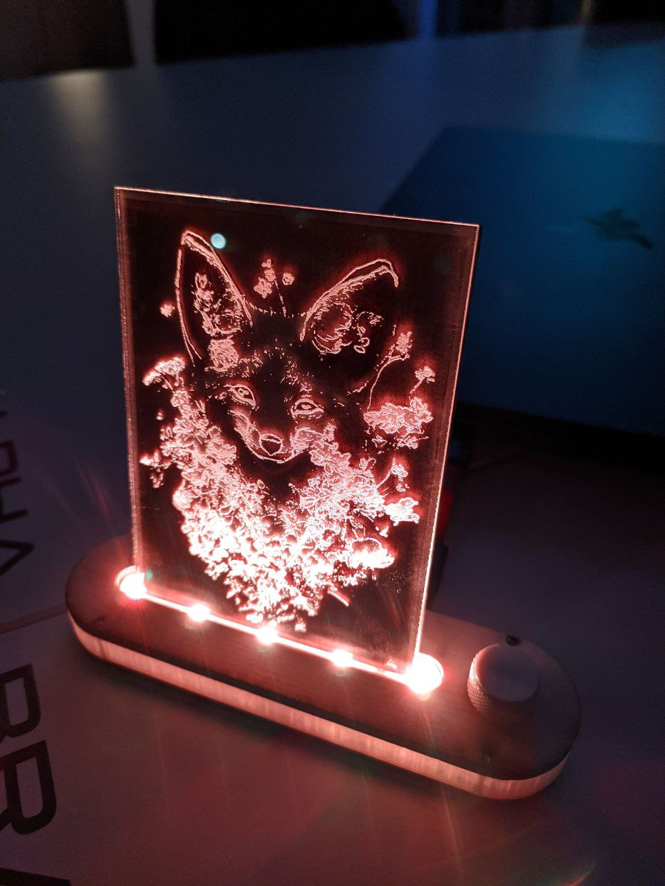
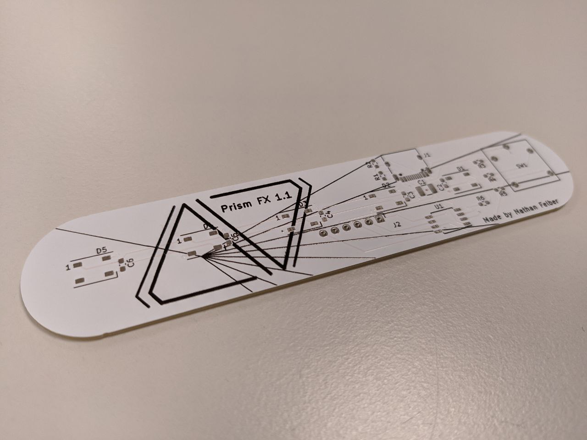
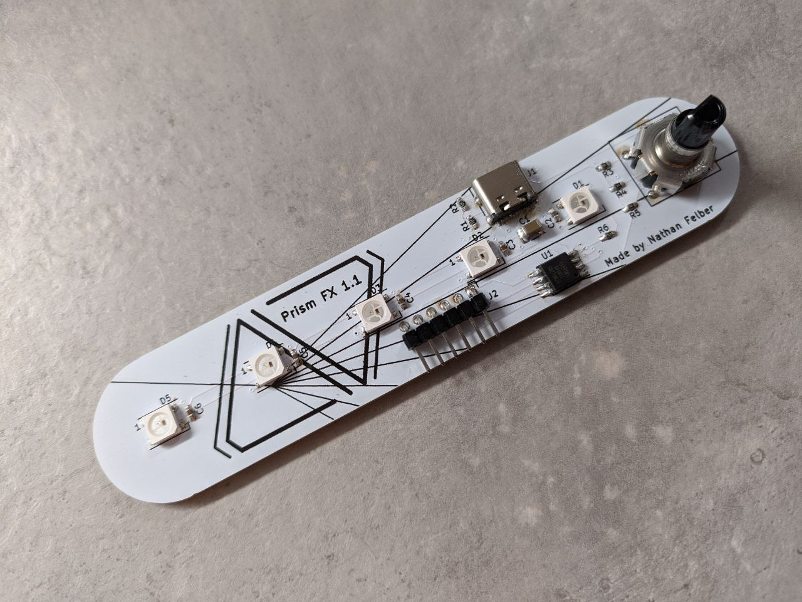

# RGB Art Frame

DIY art stand for small engraved artworks based on a custom pcb with several RGB effects.






## The PCB

This design is based on a custom printed circuit board made with KiCad for which all the project files are found in this repository.
The file `design-files/prism-fx_v1_1_gerber.zip` can be uploaded directly to most manufacturers' websites to order your own. You will find the list of all required components for hand soldering in `./design-files/pcb-components-list.csv`.




## The base

The base is laser cut using wood and acrylic (with the intermediate part alternatively 3D printed in translucent material) and held together with four 16mm M2.5 screws.
I also designed a simple cap for the knob which you can 3D print.
Everything was designed using FreeCAD in the project file `model.FCStd`.
You will also find `.stl` and `.dxf` files in the `design-files/` to use straightaway.

Note that some metrics may need to be slightly adjusted depending on the laser cutter or 3D printer.

## The arts

Pretty much anything can be used with the RGB base, but I personnally decided to engrave AI-generated images on wood with an etched layer of acryllic on top to capture light and highlight the edges of the pictures.
I'm not sharing the arts here, as the point to me is that they are unique and personnal.
Be creative!

## The program

The ATtiny85 microcontroller can be easily programmed using an Arduino board as a programmer and with the help of the Arduino IDE.
Many tutorials are available online.
Please note that the USB-C port is only used for powering the circuit board, thus it is **not** possible to program the microcontroller throught it.
Use the PCB's 6 header pins instead.
In order to work with the default `ArduinoISP` sketch, connect them to the Arduino GPIOs as shown below:

```console
      The 6 pins
 .   .   .   .   .   .
[ ] [ ] [ ] [ ] [ ] [ ]
 |   |   |   |   |   |  
 |   |   |   |   |   |    

 +   -   10  13  12  11  <- Arduino GPIOs
```

You will find an example sketch in `prism_fx/prism_fx.ino`.
The sketch shows a way of using interrupts to react to knobs events, the `Adafruit_NeoPixel` library to control the RGB Neopixels, and to storing the last effect state in the permanent EEPROM storage.
Feel free to customize it with you own effects.

In the example sketch, the device cycles through the 3 following modes by pressing down the knob:

1. Effect mode: turing the knob changes the lighting effect among the following:
	- Spectrum: slowly cycle through every color hues.
	- Rainbow: like spectrum, but the LEDs are not synchronized.
	- Static: static color.
	- Fire: fire/candle effect of a static color.
	- Flash: flashes randomly in white.
	- Test: display the current parameter value in binary.
2. Parameter mode: turing the knob changes the value of a parameter between 0 and 31, which has the following result depending on the effect:
	- Spectrum: change cycle speed.
	- Rainbow: change randbow spread in the hue space.
	- Static: change the color.
	- Fire: change the color.
	- Flash: change the frequency of the flashes.
	- Test: display the current parameter value in binary.
3. Brightness mode: turning the knob changes the brightness of the LEDs.
